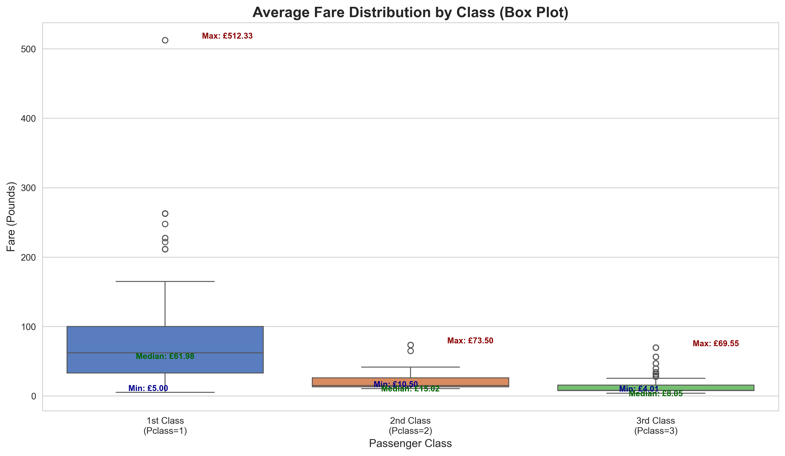

# The Temporal Rift on the Titanic: GM Guide

**Player Role:** You are a team of time travelers.
**Final Goal:** Before the ship sinks, find 5 missing 'temporal coordinate fragments'.

--- 
## Challenge 1: Purser's Office (Find the Anomaly)

**Story:** You've just boarded and been caught as stowaways. On the desk is a stack of passenger registration cards. You must identify the 'forged' card among them.

**Task:** Out of the following 6 passenger cards, which one is statistically impossible?



### Passenger Cards (Show to Players)

**Card 1**
```
name: Asim, Mr. Adola
Pclass: 3
Age: 35.0
Sex: male
Fare: 7.05
Embarked: S
```
**Card 2**
```
name: Pernot, Mr. Rene
Pclass: 2
Age: nan
Sex: male
Fare: 15.05
Embarked: C
```
**Card 3**
```
name: Johansson, Mr. Erik
Pclass: 3
Age: 22.0
Sex: male
Fare: 7.8
Embarked: S
```
**Card 4**
```
name: Laroche, Miss. Simonne Marie Anne Andree
Pclass: 3
Age: 3.0
Sex: female
Fare: 78.25
Embarked: C
```
**Card 5**
```
name: Sharp, Mr. Percival James R
Pclass: 2
Age: 27.0
Sex: male
Fare: 26.0
Embarked: S
```
**Card 6**
```
name: O'Brien, Mrs. Thomas (Johanna "Hannah" Godfrey)
Pclass: 3
Age: nan
Sex: female
Fare: 15.5
Embarked: Q
```

---
### GM Guide

> **Hint:** GM Hint: Refer to the box plot above. The forged card has a fare that doesn't match its class - either much higher or much lower than typical for that class. Players should compare each card's fare with the distribution shown in the chart for that card's class.
> **Answer:** [[REVEAL_ANSWER]]The forged card: 3rd class (Pclass=3) but paying £78.25, which is much higher than typical 3rd class fares (£4.01-69.55). **(In this game, this card is Card 4)**[[END_REVEAL]]
> **Obtain:** **Temporal Coordinate Fragment 1** hidden under the forged card.

---
## Challenge 2: Echoes of the Passengers (Timeline Synchronization)

**Story:** Time ripples carry brief echoes of five travelers aboard the Titanic. Align their moments to restore the timeline.

**Known Facts**
- Boarding order by port: Southampton (S) → Cherbourg (C) → Queenstown (Q).
- Phrases like 'boarded at' are before the iceberg impact.
- Words like 'tilted', 'helping', or 'chaos' are after impact but still onboard.
- Mentions of 'escaped' or 'lifeboat' happen last.

### Echoes (Show to Players)

- Echo A: Lanterns sway as the deck tilts; Laleff steadies a stranger amid rising alarm.
- Echo B: In the final chaos, Marvin finds space in a lifeboat and slips into the night.
- Echo C: Olsen boards at Southampton (S); a third-class ticket rustles in hand.
- Echo D: Paulner boards at Cherbourg (C); a third-class ticket rustles in hand.
- Echo E: Rice boards at Queenstown (Q); a third-class ticket rustles in hand.

**Task:** Arrange the echoes (A–E) in correct chronological order.

---
### GM Guide

> **Answer:** [[REVEAL_ANSWER]]Correct order: C, D, E, A, B. Boarding echoes come first and follow port order S → C → Q; post-impact echoes (tilted/helping/chaos) follow; the lifeboat escape is last.[[END_REVEAL]]
> **Obtain:** **Temporal Coordinate Fragment 2** revealed when the order is correct.

---
## Decipher the Lifeboat Code

**Story:** The lifeboat lock requires a 4-digit code based on passengers' survival predictions.

**Task:** Predict which of the 4 passengers survived (1) or perished (0). Use the survival clues provided.


### Passenger Cards (Show to Players)

**Card 1**
```
Name: Banfield, Mr. Frederick James
Pclass: 2
Age: 28
Sex: male
Fare: 10.5
Embarked: S
```
**Card 2**
```
Name: Davies, Mr. Charles Henry
Pclass: 2
Age: 18
Sex: male
Fare: 73.5
Embarked: S
```
**Card 3**
```
Name: Carter, Mrs. William Ernest (Lucile Polk)
Pclass: 1
Age: 36
Sex: female
Fare: 120.0
Embarked: S
```
**Card 4**
```
Name: Yousif, Mr. Wazli
Pclass: 3
Age: 44
Sex: male
Fare: 7.22
Embarked: C
```

---
### GM Guide

> **Hint:** Use the survival charts above to infer the 4-digit lifeboat code.
> **Answer:** [[REVEAL_ANSWER]]0010[[END_REVEAL]]
> **Obtain:** **Temporal Coordinate Fragment 3** hidden within the lifeboat control panel.

---
## Letters from a Stowaway

**Story:** 
    
    The Captain has called you and your group to the deck of the ship with an 
    urgent mission. Telegrams have been intercepted from the ship's Marconi machine
    and it appears there is a stowaway on board! Unfortunately, the dastardly 
    stowaway has managed to scramble one of the telegrams using a mysterious code. 
    The Captain has created a list of 10 suspects. Can you decipher the letter and
    obtain the identity of the suspect before they get away?!
    
    

**Task:** Decode the encrypted letter and select the name from the list of suspects.

### Letters from the Stowaway 

**Plaintext Letter**```   
R.M.S. TITANIC  
MARCONI WIRELESS SERVICE  
APRIL 12, 1912
To Mr. David Smith
Good afternoon, I have snuck aboard this mighty vessel. 
Now time to implement my darstardly plan!
Yours Sincerely,

A Guest of the Deep
```
**Encrypted Letter**```
a.d.o. bsbwjsq  
dwaqrjs zsalfloo olaisql  
wnasf 12, 1912
dk olqalb wfswo so da vwdlo drawj

w hmlob re bxl ylln
```
### Possible suspects 

---
## Game End

Congratulations! You've collected all 5 coordinate fragments, restarted the time machine, and successfully escaped from 1912 at the moment the Titanic sank.
