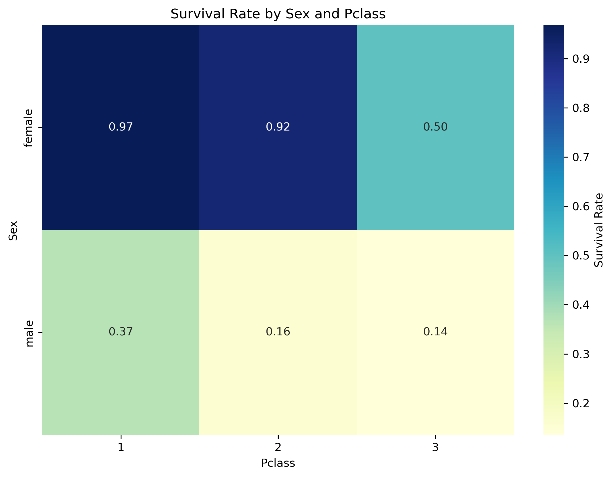
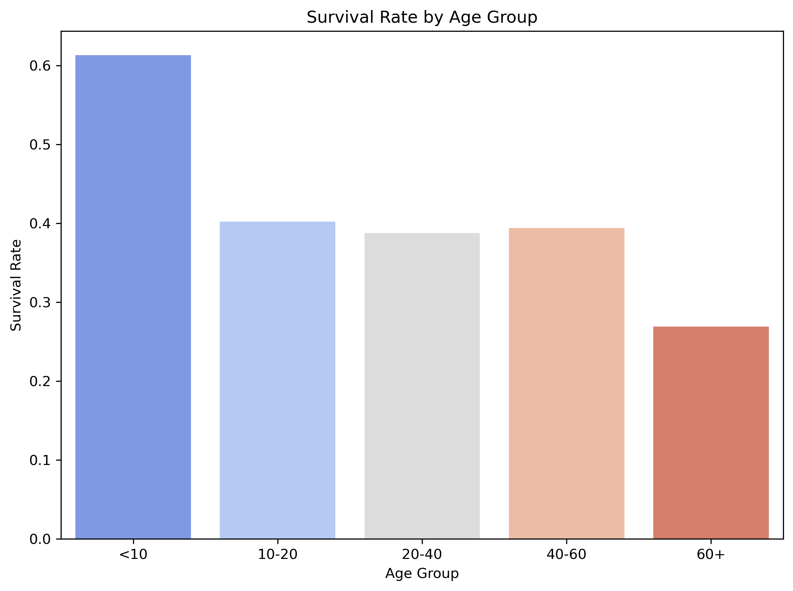

# The Temporal Rift on the Titanic: GM Guide

**Player Role:** You are a team of time travelers.
**Final Goal:** Before the ship sinks, find 5 missing 'temporal coordinate fragments'.

--- 
## Challenge 1: Purser's Office (Find the Anomaly)

**Story:** You've just boarded and been caught as stowaways. On the desk is a stack of passenger registration cards. You must identify the 'forged' card among them.

**Task:** Out of the following 6 passenger cards, which one is statistically impossible?


### Passenger Cards (Show to Players)

**Card 1**
```
name: Plotcharsky, Mr. Vasil
Pclass: 3
Age: nan
Sex: male
Fare: 7.9
Embarked: S
```
**Card 2**
```
name: Turpin, Mr. William John Robert
Pclass: 2
Age: 29.0
Sex: male
Fare: 21.0
Embarked: S
```
**Card 3**
```
name: Turja, Miss. Anna Sofia
Pclass: 3
Age: 18.0
Sex: female
Fare: 9.84
Embarked: S
```
**Card 4**
```
name: Calic, Mr. Petar
Pclass: 1
Age: 17.0
Sex: male
Fare: 4.18
Embarked: S
```
**Card 5**
```
name: Hocking, Mr. Richard George
Pclass: 2
Age: 23.0
Sex: male
Fare: 11.5
Embarked: S
```
**Card 6**
```
name: Williams, Mr. Charles Duane
Pclass: 1
Age: 51.0
Sex: male
Fare: 61.38
Embarked: C
```

---
### GM Guide

> **Hint:** GM Hint: Refer to the box plot above. The forged card has a fare that doesn't match its class - either much higher or much lower than typical for that card's class. Players should compare each card's fare with the distribution shown in the chart for that card's class.
> **Answer:** [[REVEAL_ANSWER]]The forged card: 1st class (Pclass=1) but paying £4.18, which is slightly lower than typical 1st class fares (£5.00-512.33). **(In this game, this card is Card 4)**[[END_REVEAL]]
> **Obtain:** **Temporal Coordinate Fragment 1** hidden under the forged card.

---

## Challenge 2: Decoding Station (Crossword Puzzle)

You find a security terminal that requires decoding. The system displays a crossword puzzle that must be solved to access temporal coordinates.

**Task:** Complete the crossword puzzle using the column names from the Titanic dataset.

<div id='crossword-container' data-words='["Fare", "Name", "Cabin", "Ticket", "Parch"]' data-grid='[["", "", "", "T", ""], ["", "", "", "I", ""], ["", "", "", "C", ""], ["", "N", "", "K", ""], ["F", "A", "R", "E", ""], ["", "M", "", "T", ""], ["", "E", "", "", ""], ["C", "A", "B", "I", "N"], ["", "", "", "", ""], ["P", "", "", "", ""], ["A", "", "", "", ""], ["R", "", "", "", ""], ["C", "", "", "", ""], ["H", "", "", "", ""]]' data-placed-words='[{"word": "FARE", "row": 4, "col": 0, "direction": "across"}, {"word": "NAME", "row": 3, "col": 1, "direction": "down"}, {"word": "CABIN", "row": 7, "col": 0, "direction": "across"}, {"word": "TICKET", "row": 0, "col": 3, "direction": "down"}, {"word": "PARCH", "row": 9, "col": 0, "direction": "down"}]'></div>

**Hint:** GM Hint: Think about the column headers from the Titanic passenger database. The words are related to passenger information.

[[REVEAL_ANSWER]]<div class='answer-image-container'></div>[[END_REVEAL]]

---
## Decipher the Lifeboat Code

**Story:** The lifeboat lock requires a 4-digit code based on passengers' survival predictions.

**Task:** Predict which of the 4 passengers survived (1) or perished (0). Use the survival clues provided.





### Passenger Cards (Show to Players)

**Card 1**
```
Name: Webber, Miss. Susan
Pclass: 2
Age: 32
Sex: female
Fare: 13.0
Embarked: S
```
**Card 2**
```
Name: Adams, Mr. John
Pclass: 3
Age: 26
Sex: male
Fare: 8.05
Embarked: S
```
**Card 3**
```
Name: Carter, Mrs. William Ernest (Lucile Polk)
Pclass: 1
Age: 36
Sex: female
Fare: 120.0
Embarked: S
```
**Card 4**
```
Name: Downton, Mr. William James
Pclass: 2
Age: 54
Sex: male
Fare: 26.0
Embarked: S
```

---
### GM Guide

> **Hint:** Use the survival charts above to infer the 4-digit lifeboat code.
> **Answer:** [[REVEAL_ANSWER]]1010[[END_REVEAL]]
> **Obtain:** **Temporal Coordinate Fragment 3** hidden within the lifeboat control panel.

---
## Game End

Congratulations! You've collected all 5 coordinate fragments, restarted the time machine, and successfully escaped from 1912 at the moment the Titanic sank.
