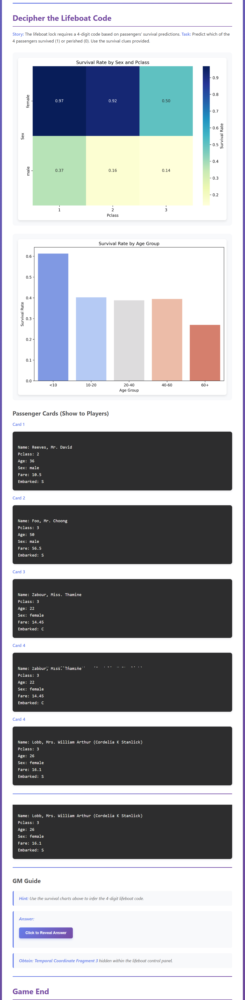

## 🧩 Challenge 3 – Decipher the Lifeboat Code

**Contributor:** ZIHUI LI 

---

### Objective
In this stage, players must **analyze real Titanic survival data** to unlock a **4-bit binary lifeboat code**.  
The code determines whether the crew can escape before the ship sinks.

---

### Game Concept
  
The control console displays a cryptic binary interface, requiring insight into **who survived and who didn’t**.

The GM provides **4 passenger cards** and two analytical hint panels:
1. **Survival Probability by Sex & Pclass**  
2. **Survival Probability by Age Group**

Players use reasoning to assign `1` (survived) or `0` (did not survive) and form the lifeboat code.

---

### 📊 Data-Driven Puzzle Design
Using Titanic dataset analysis:

| Factor | Trend |
|--------|--------|
| **Gender** | Females more likely to survive |
| **Pclass** | Higher class, higher survival |
| **Age** | Younger passengers more likely to survive |

---

### Implementation Summary
- Implemented in `generate_challenge_3()`  
- Produces JSON with keys: `title`, `story`, `task`, `passenger_cards`, `hint`, `hint_chart`, `answer`
- Integrated seamlessly into the unified GM system through `convert_to_html.py`
- Preserves the same UI and interaction as Challenge 1, adding data visualization in the Reveal Answer area

---

### GM Interface Preview
Below is the in-game GM view for Challenge 3, including the analytical panels and Reveal Answer section:

---

### Summary
> **Challenge 3: Decipher the Lifeboat Code**  
> blends real-world data science with narrative gameplay,  
> teaching survival pattern analysis through an interactive escape puzzle.

---

**Course:** Advanced Programming  
